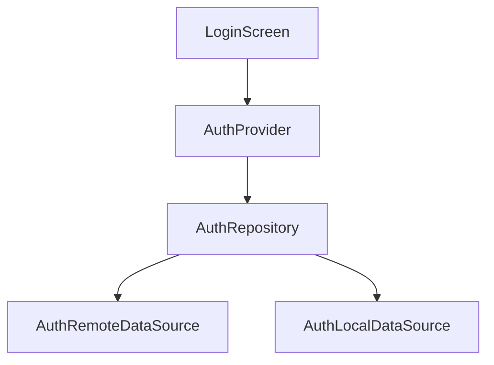
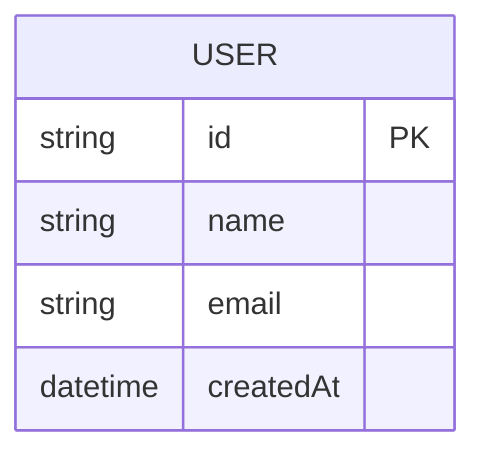
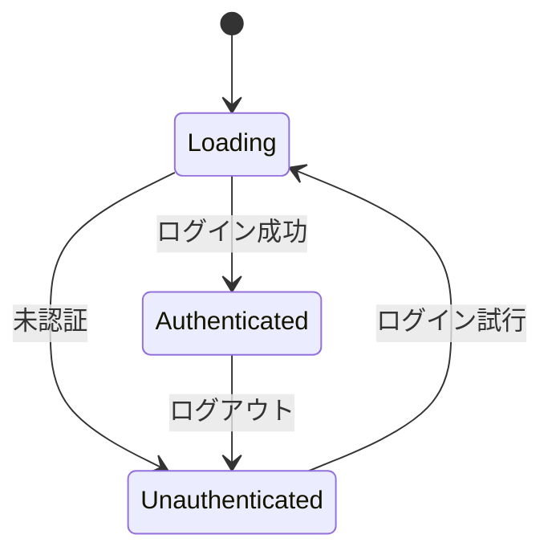

# 機能設計書テンプレート

## [機能名]

### 概要
[機能の目的と範囲を記述]

---

## 1. 機能要件

### 1.1 ユーザーストーリー
| ID | As a | I want | So that |
|----|------|--------|---------|
| US-001 | ユーザー | ログインできる | アプリを利用できる |
| US-002 | | | |

### 1.2 機能一覧
| ID | 機能名 | 説明 | 優先度 |
|----|--------|------|--------|
| F-001 | ログイン | メール/パスワードでログイン | 高 |
| F-002 | | | |

---

## 2. 非機能要件

### 2.1 パフォーマンス
- 画面表示: X秒以内
- API応答: Y秒以内

### 2.2 セキュリティ
- 認証方式: JWT
- データ暗号化: AES-256

### 2.3 可用性
- 対応OS: Android 8.0+, iOS 14.0+
- オフライン対応: [有/無]

---

## 3. アーキテクチャ

### 3.1 レイヤー構成
```
Presentation (UI/Widget)
    ↓
Application (Provider/State)
    ↓
Domain (Entity/UseCase)
    ↓
Data (Repository/DataSource)
```

### 3.2 依存関係図


---

## 4. データモデル

### 4.1 Entity
```dart
@freezed
class User with _$User {
  const factory User({
    required String id,
    required String name,
    required String email,
  }) = _User;
}
```

### 4.2 ER図


---

## 5. API設計

### 5.1 エンドポイント
| メソッド | パス | 説明 |
|---------|------|------|
| POST | /auth/login | ログイン |
| POST | /auth/logout | ログアウト |
| GET | /auth/me | 現在のユーザー取得 |

### 5.2 リクエスト/レスポンス

#### POST /auth/login
**Request:**
```json
{
  "email": "user@example.com",
  "password": "password123"
}
```

**Response:**
```json
{
  "user": {
    "id": "xxx",
    "name": "User Name",
    "email": "user@example.com"
  },
  "token": "eyJhbGciOiJIUzI1..."
}
```

---

## 6. 状態管理

### 6.1 Provider構成
| Provider | 種類 | 役割 |
|----------|------|------|
| authProvider | AsyncNotifierProvider | 認証状態管理 |
| userProvider | FutureProvider | ユーザー情報取得 |

### 6.2 状態遷移図


---

## 7. エラーハンドリング

| エラーコード | 原因 | 対応 |
|-------------|------|------|
| AUTH_001 | 認証失敗 | エラーメッセージ表示 |
| NET_001 | ネットワークエラー | リトライUI表示 |

---

## 8. テスト計画

### 8.1 テストケース
| ID | 種別 | 対象 | 内容 |
|----|------|------|------|
| TC-001 | Unit | AuthNotifier | ログイン成功 |
| TC-002 | Widget | LoginScreen | フォーム表示 |
| TC-003 | Integration | ログインフロー | E2E |

---

## 改訂履歴

| 日付 | バージョン | 内容 | 担当 |
|------|-----------|------|------|
| YYYY-MM-DD | 1.0 | 初版作成 | |
